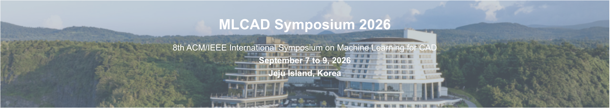
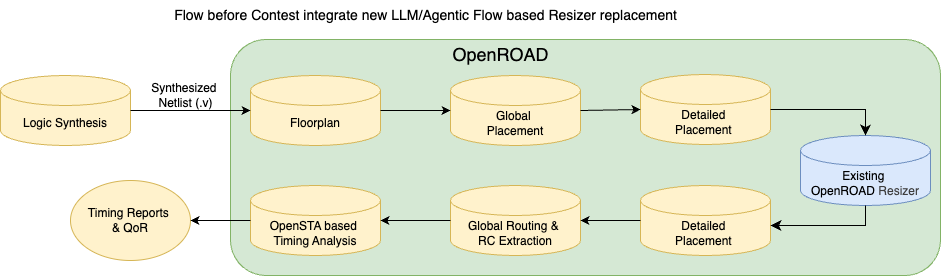
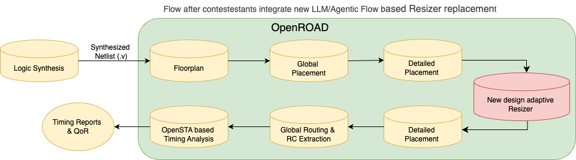

# **LLM based Algorithm Discovery for OpenROAD Resizer **

Join the exciting MLCAD 2026 Contest and showcase your innovative skills in combining Agentic Large Language Model flows with electronic design automation (EDA). This year's challenge focuses on Algorithm discovery using LLMs and Agentic workflows for Electronic Design Automation.

**Winners of this year's contest will be invited to MLCAD2026 to present their solutions as a paper**

## Contest Overview

The goal of this contest is to create a design-aware Resizer within OpenROAD. Specifically, this means that the Resizer’s internal algorithms or source code may change depending on the design to which it is applied. Contestants begin with the baseline OpenROAD Resizer, whose source code and heuristics remain fixed across all designs. 

Participants may use LLMs/Agentic Workflows or other methods to develop a new algorithms or optmize OpenROAD's existing resizers internal algorithms on a **per-design basis**

<!-- ###  We have released the content details, please find the information in [*MLCAD25-Contest-Scripts-Benchmarks*](https://github.com/ASU-VDA-Lab/MLCAD25-Contest-Scripts-Benchmarks). -->
<!-- ### Please find the contest description [*here*](https://github.com/ASU-VDA-Lab/MLCAD25-Contest-Scripts-Benchmarks/blob/main/MLCAD2025-Contest-Problem-Statement.pdf). -->

## Contest Challenges Include:

- Applying machine learning techniques (supervised, unsupervised, reinforcement learning) for logic resynthesis.
- Ensuring physical awareness in resynthesis and ensuring routability without congestion overflows.
- Demonstrating timing improvements post global route by performing netlist optimizations post logic synthesis. 

## Updates:
We have extended the alpha submission deadline to June 15th.

## Why Participate?

- Showcase your AI-driven EDA innovations and state-of-the-art algorithms for physical-aware logic resynthesis. 
- Apply for **travel grants** (available for eligible participants) to MLCAD 2025.
- Winners will receive high-performance NVIDIA GPUs as prizes!

## Registration, Participants List, and Important Dates

## Registration

- Registration opens: **TBD**
- Registration deadline: **TBD**
- Registrations closed. 

## Participants List:

If you have any questions about registration, please feel free to contact us through the email provided at the end of the page.

|Team ID|Team Name         |Affiliation                                |
|-------|------------------|-------------------------------------------|
|team1  |reinforcedAg      |Texas A&M University                       |
|team2  |SlugSignal        |UCSC                                       |
|team3  |dzzz              |The Chinese University of Hong Kong        |
|team4  |Blue Team         |UCSC                                       |
|team5  |BluePhone         |Independent                                |
|team6  |Netlist Ninjas    |Nirma University                           |
|team7  |BW4A              |upm                                        |
|team8  |drexel-ice        |Drexel university                          |
|team9  |ssatyendras       |IMEC                                       |
|team10 |PACE              |University of Maryland, College Park       |
|team11 |SeDA              |UNIST (South Korea)                        |
|team12 |X_PhyicalSynthesis|Fudan University                           |
|team13 |CSDL              |Pohang University of Science and Technology|
|team14 |ASEEC Lab         |University of California, Davis            |
|team15 |DibFan            |UT Austin                                  |
|team16 |delftBlue         |Delft University of Technology             |
|team17 |Slug Cricket      |UCSC                                       |
|team18 |SGCAD             |Sogang university                          |
|team19 |AI4Semi           |Samsung Semiconductor                      |
|team20 |Randomize         |Fudan University                           |
|team21 |CDA               |TUM                                        |
|team22 |Alrwave           |Fudan University                           |
|team23 |PhyMap            |Fudan University                           |
|team24 |ChandraMind       |Arizona State University*                  |
|team25 |LOGIC101          |Arizona State University*                  |
|team26 |Physical AI       |Arizona State University*                  |
|team27 |ACE-DMA           |NXP Semiconductors                         |

## Contest Timeline

| Milestone                 | Date            |
| ------------------------- | --------------- |
| Contest Begins            | April 23, 2026  |
| Registration Closes       | April 23, 2026  |
| Alpha Submission Deadline | June 15, 2026    |
| Beta Submission Deadline  | July 20, 2026   |
| Final Submission Deadline | August 10, 2026 |
| Results Announcement      | September 2026  |

## Prizes

<!-- Top-performing teams will receive **NVIDIA GPUs** as awards! These can be used for further research! -->
Top-performing team(s) will be sponsored to present their solutions in [MLCAD2026](https://mlcad.org/symposium/2026/)

## Contest Details
###  We have released the content details, please find the information in 
<!-- [*MLCAD25-Contest-Scripts-Benchmarks*](https://github.com/ASU-VDA-Lab/MLCAD25-Contest-Scripts-Benchmarks). -->
 

## About MLCAD

The International Workshop on Machine Learning for CAD (MLCAD) is the leading venue dedicated to advancing research at the intersection of machine learning and electronic design automation (EDA). It provides a unique platform for collaboration between academia and industry, fostering innovation and driving progress in AI-driven CAD solutions.

**Join the contest, push the boundaries of EDA, and lead the future of AI in chip design!**

## Acknowledgement

<!-- We thank NVIDIA for sponsoring the contest, GPU awards, and their involvement in organizing it. -->

Thanks to:
- NSF POSE
- NSF Chipshub
- MLCAD2026 

for sponsoring this contest and their involvement in organizing it. 

## Contest organizers

| Name                   | Affiliation |
| ---------------------- | ----------- |
| Atmadip Dey            | ASU         | 
| Taizun Jafri           | ASU         |
| Janakiraman Ethirajulu | ASU         |
| Vidya A Chhabria       | ASU         |

For questions, reach out to mlcad2026-contest@googlegroups.com

*Please note that these teams are not from the research groups organizing the contest. ASU and NVIDIA research teams will not be eligible for prizes even if there are participants from these institutions. 
