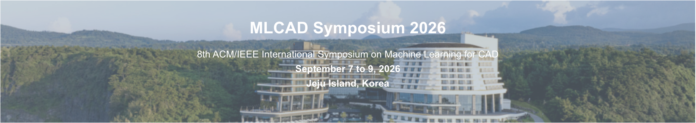
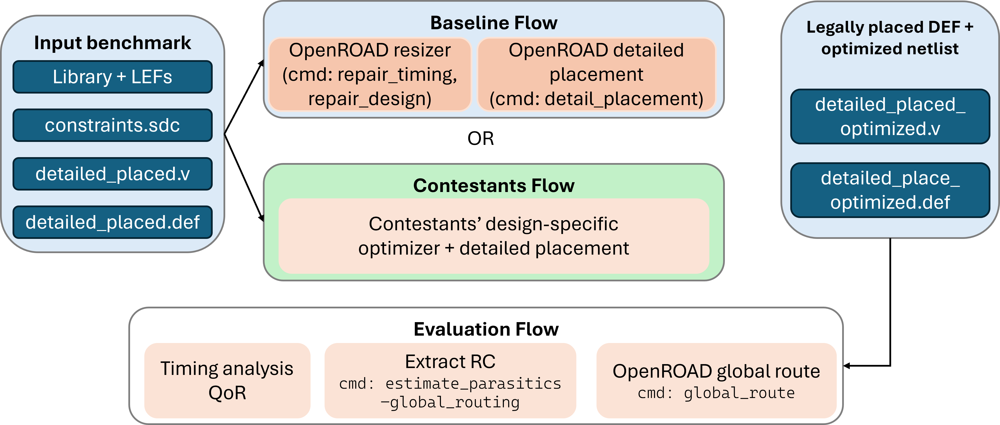
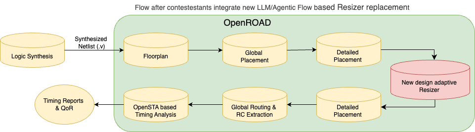

# **LLM-based Algorithm Discovery for Timing Optimization**

Join the exciting MLCAD 2026 Contest and showcase your innovative skills in combining agentic Large Language Model (LLM) flows with Electronic Design Automation (EDA). This year's challenge focuses on algorithm discovery using LLMs for timing optimization. 

**Winners of this year's contest will be invited to MLCAD2026 to present their solutions as a paper in the proceedings**

**Please register [here](https://form.jotform.com/260577193935165).**

## Contest Overview

The goal of this contest is to create a design-aware timing optimization tool. Specifically, this means you can use an LLM to update/generate/modify the EDA tool's source code and/or internal algorithms, depending on the design to which it is applied. Contestants may begin with the baseline OpenROAD  source code. 

Participants may use LLMs or agentic workflows or other methods to develop new algorithms for timing optimization and legalization on a **per-design basis**
<!-- 
 -->

## Contest Challenge

- Designing a design-adaptive timing optimization algorithm that dynamically modifies strategies based on the characteristics of each design.
- Applying LLM-based or agentic optimization workflows to discover, generate, or evolve timing optimization.
- Demonstrating improved timing closure and overall design quality after placement legalization and global routing, while balancing power, routability, and runtime constraints. 

## Why Participate?

- Showcase your innovative solutions at MLCAD 2026. **Winners will have their papers invited to the MLCAD 2026 Proceedings!**
- Apply for **travel grants** (available for eligible participants) to MLCAD 2026.
- Winners will receive high-performance NVIDIA GPUs as prizes!

## Registration, Participants List, and Important Dates

### Registration

- Registration opens   : March 1, 2026
- Registration deadline: April 10, 2026

**Please register [here](https://form.jotform.com/260577193935165).**

### Registered Teams

To be added after March 15th. 

### Contest Details

We have released the contest details in the [contest description document](https://github.com/ASU-VDA-Lab/MLCAD26-Contest/MLCAD2026-Contest-Algorithm-Discovery.pdf).
We will shortly release the repository for the benchmark and evaluation scripts. 
<!-- ### Please find the contest description [*here*](https://github.com/ASU-VDA-Lab/MLCAD26-Contest-Scripts-Benchmarks/blob/main/MLCAD2026-Contest-Problem-Statement.pdf). -->

### Contest Timeline

<!-- | Milestone                 | Date                                              |
| ------------------------- | ------------------------------------------------- |
| Registration Opens        | February 20, 2026                                 |
| Registration Deadline     | March 10, 2026                                    |
| Alpha Submission Deadline | April 1, 2026                                     |
| Beta Submission Deadline  | May 1, 2026                                       |
| Final Submission Deadline | June 15, 2026                                     |
| Results Announcement      | June 25, 2026 (With invitation to Submit a paper) |
| Camera-Ready Version      | July 25, 2026                                     | -->

| Phase             | Milestone                                                    | Date           |
| ----------------- | ------------------------------------------------------------ | -------------- |
| Announcement      | Contest Announcement                                         | March 1, 2026  |
| Benchmark Release | Initial benchmark suite                                      | March 4, 2026  |
| Registration      | Registration deadline                                        | April 10, 2026 |
| Alpha Phase       | Alpha submission                                             | April 30, 2026 |
| Beta Phase        | Beta submission – Testcase 1 release                         | May 5, 2026    |
| Beta Phase        | Beta submission – Testcase 1 deadline and Testcase 2 release | May 15, 2026   |
| Beta Phase        | Beta submission – Testcase 2 deadline and Testcase 3 release | May 25, 2026   |
| Beta Phase        | Beta submission – Testcase 3 deadline                        | June 5, 2026   |
| Results           | Results announcement                                         | June 15, 2026  |
| Publication       | Camera-ready paper                                           | July 25, 2026 |

## Prizes

<!-- Top-performing teams will receive **NVIDIA GPUs** as awards! These can be used for further research! -->
Top-performing team(s) will be invited to present their solutions in [MLCAD2026](https://mlcad.org/symposium/2026/). 
## Contest Details

###  We will release the content details soon. Please find the information in [*MLCAD26-Contest-Scripts-Benchmarks*](https://github.com/ASU-VDA-Lab/MLCAD26-Contest-Scripts-Benchmarks).
 

## About MLCAD

The International Workshop on Machine Learning for CAD (MLCAD) is the leading venue dedicated to advancing research at the intersection of machine learning and electronic design automation (EDA). It provides a unique platform for collaboration between academia and industry, fostering innovation and driving progress in AI-driven CAD solutions.

**Join the contest, push the boundaries of EDA, and lead the future of AI in chip design!**

## Acknowledgement

<!-- We thank NVIDIA for sponsoring the contest, GPU awards, and their involvement in organizing it. -->

Thanks to:

- UCSD and the NSF POSE: Phase II: Growing a Collaborative Ecosystem for Open-Source Chip Design Using OpenROAD
- Purdue University and the NSF Chipshub

for sponsoring this contest and their involvement in organizing it. 

## Contest organizers

| Name                   | Affiliation |
| ---------------------- | ----------- |
| Atmadip Dey            | ASU         | 
| Taizun Jafri           | ASU         |
| Janakiraman Ethirajulu | ASU         |
| Vidya A Chhabria       | ASU         |

For questions, reach out to mlcad2026-contest@googlegroups.com

*Please note that teams from ASU will not be eligible for prizes even if there are participants. 
